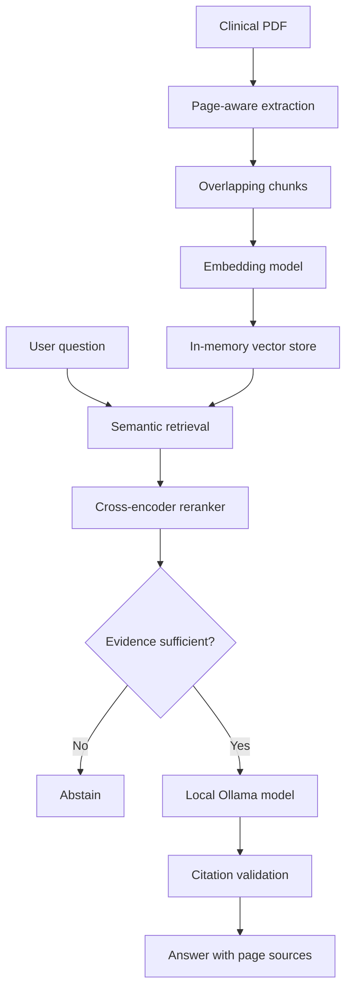

# Clinical Evidence Assistant

A local, citation-grounded AI assistant that answers questions about clinical PDF documents using retrieval-augmented generation (RAG).

The system retrieves relevant passages, reranks them for relevance, generates an answer using a local Ollama model, and links every answer to its supporting document pages. It abstains when the available evidence is insufficient.

> This project is an educational portfolio demonstration. It is not a medical device and must not be used for clinical decision-making. Do not upload documents containing protected health information.

## Key features

- Extracts text from PDF documents while preserving page numbers
- Splits extracted text into overlapping, page-aware chunks
- Generates local embeddings using Sentence Transformers
- Retrieves relevant passages using semantic similarity
- Reranks candidate passages with a cross-encoder
- Rejects questions when retrieved evidence is insufficient
- Generates grounded answers using a local Ollama model
- Validates citations returned by the language model
- Displays answers and supporting evidence in a Streamlit interface
- Includes automated tests and reproducible retrieval evaluations

## Architecture



## Technology stack

- Python 3.11
- FastAPI
- Streamlit
- Ollama with `llama3.2:3b`
- Sentence Transformers
- `all-MiniLM-L6-v2` embedding model
- `ms-marco-MiniLM-L6-v2` cross-encoder reranker
- pypdf
- pytest
- httpx

## Why reranking is used

Embedding similarity alone could not reliably distinguish answerable from unanswerable questions.

| Question group | Embedding top-score range |
|---|---:|
| Answerable | 0.2908–0.6372 |
| Unanswerable | 0.1595–0.5940 |

Because these ranges overlap, a simple embedding-score threshold would produce unreliable abstention decisions.

A cross-encoder reranker produced better separation:

| Question group | Reranker top-score range |
|---|---:|
| Answerable | -2.4787–9.5938 |
| Unanswerable | -11.0056–-4.5677 |

The evaluation suggested an abstention threshold of approximately `-3.5`. Questions scoring below this threshold are rejected before answer generation.

The threshold is configurable through the `RERANKER_THRESHOLD` environment variable.

## Evaluation results

Evaluation uses a synthetic clinical study document so the tests are reproducible and contain no patient information.

| Metric | Result |
|---|---:|
| Questions | 10 |
| Answerable questions | 6 |
| Unanswerable questions | 4 |
| Retrieval Hit@3 | 100% |
| Reranked MRR | 1.000 |
| Automated tests | 15 passed |

These results demonstrate the pipeline on a small synthetic dataset. They should not be interpreted as evidence of real-world clinical performance.

## Project structure

```text
clinical-evidence-assistant/
├── app/
│   ├── main.py
│   └── services/
│       ├── citation_validator.py
│       ├── llm_service.py
│       ├── pdf_extractor.py
│       ├── reranker_service.py
│       ├── text_chunker.py
│       └── vector_store.py
├── evaluation/
│   ├── create_sample_data.py
│   ├── questions.json
│   ├── run_retrieval_evaluation.py
│   ├── run_reranker_evaluation.py
│   └── sample_clinical_study.pdf
├── tests/
├── frontend.py
├── requirements.txt
└── README.md
```

## Local setup

### 1. Clone the repository

```bash
git clone https://github.com/rohansingh72/clinical-evidence-assistant
cd clinical-evidence-assistant
```

### 2. Create and activate a virtual environment

```bash
python3 -m venv .venv
source .venv/bin/activate
```

### 3. Install dependencies

```bash
python -m pip install -r requirements.txt
```

### 4. Install and prepare Ollama

Install [Ollama](https://ollama.com/) and download the model:

```bash
ollama pull llama3.2:3b
```

Ensure Ollama is running before asking answerable questions.

## Running the application

Start the FastAPI backend:

```bash
python -m uvicorn app.main:app --reload
```

In a second terminal, start the Streamlit interface:

```bash
source .venv/bin/activate
python -m streamlit run frontend.py
```

Open:

```text
http://localhost:8501
```

Upload and index a PDF, then ask questions about its contents.

## Example questions

Using `evaluation/sample_clinical_study.pdf`:

Answerable:

```text
What type of study design was used?
```

Unanswerable:

```text
What were the final efficacy results?
```

The second question should trigger abstention because the indexed document does not contain final efficacy results.

## Running tests

```bash
python -m pytest -v
```

Current result:

```text
15 passed
```

## Running evaluations

Start the FastAPI backend before running the evaluation scripts.

Retrieval evaluation:

```bash
python evaluation/run_retrieval_evaluation.py
```

Reranker and abstention evaluation:

```bash
python evaluation/run_reranker_evaluation.py
```

## API endpoints

- `GET /health` — application health check
- `POST /documents/index` — extract, chunk, embed, and index a PDF
- `POST /search` — retrieve relevant document passages
- `POST /answer` — rerank evidence and generate a cited answer or abstain
- `GET /docs` — interactive FastAPI API documentation

## Current limitations

- Documents and embeddings are stored in memory and disappear when the backend restarts
- The evaluation dataset is small and synthetic
- Scanned PDFs requiring OCR are not currently supported
- The abstention threshold requires validation on a larger dataset
- Local model answers may vary between runs
- The system does not replace expert clinical review

## Planned improvements

- Persistent vector storage
- Support for multiple indexed documents
- OCR support for scanned PDFs
- Larger clinical evaluation dataset
- Automated integration tests for answer generation and abstention
- Docker-based deployment
- Improved observability and response-time measurements